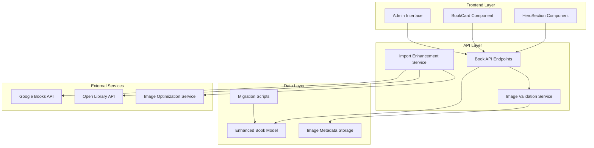

# Book Image Quality Enhancement - Technical Design Document

## Overview

This feature enhances the OursBook platform's image handling system by implementing separate high-quality images for different UI contexts. The system will support both hero images (for the main banner section) and cover images (for book cards), with automatic import of high-resolution images from external sources.

### Core Value Proposition

- **Dual Image System**: Separate hero and cover images for optimal visual presentation
- **High-Quality Import**: Automatic fetching of high-resolution images from multiple sources
- **Intelligent Fallback**: Graceful degradation when images are unavailable
- **Performance Optimization**: Efficient image loading and caching strategies
- **Legacy Compatibility**: Seamless migration of existing book data

### Key Technical Challenges

1. **Database Schema Evolution**: Adding new image fields while maintaining backward compatibility
2. **Image Quality Validation**: Ensuring imported images meet quality standards
3. **Fallback Logic**: Implementing hierarchical image fallback system
4. **Performance Impact**: Minimizing load time impact of additional images
5. **Migration Strategy**: Updating existing books without service disruption

## Architecture

### System Architecture Overview

The enhanced image system integrates with the existing OursBook architecture:



### Technology Stack Integration

**Database Enhancements:**
- **New Fields**: `heroImageUrl`, `heroImageWidth`, `heroImageHeight`
- **Migration**: Backward-compatible schema updates
- **Indexing**: Optimized queries for image-related operations

**API Enhancements:**
- **Validation**: Image URL and quality validation middleware
- **Metadata**: Image dimension and quality extraction
- **Batch Operations**: Bulk image update capabilities

**Frontend Enhancements:**
- **Type Updates**: Extended Book interface with hero image fields
- **Component Logic**: Enhanced image selection and fallback logic
- **Performance**: Lazy loading and progressive image enhancement

## Components and Interfaces

### Enhanced Data Models

#### Updated Book Model

```typescript
interface Book {
  // Existing fields
  id: string;
  title: string;
  author: string;
  isbn?: string;
  description?: string;
  genre: string;
  publicationDate?: string;
  pageCount?: number;
  language: string;
  coverImageUrl?: string;
  fileUrl: string;
  fileSize?: number;
  fileFormat: string;
  rating: number;
  downloadCount: number;
  viewCount: number;
  isFeatured: boolean;
  metadataComplete: boolean;
  createdAt: string;
  updatedAt: string;
  
  // New image fields
  heroImageUrl?: string;
  heroImageWidth?: number;
  heroImageHeight?: number;
  imageQualityScore?: number;
  lastImageUpdate?: string;
}
```

#### Image Metadata Interface

```typescript
interface ImageMetadata {
  url: string;
  width: number;
  height: number;
  fileSize: number;
  format: string;
  qualityScore: number;
  source: 'google-books' | 'open-library' | 'manual' | 'fallback';
  lastValidated: string;
}

interface ImageValidationResult {
  isValid: boolean;
  metadata?: ImageMetadata;
  errors: string[];
  suggestions: string[];
}
```

### Frontend Component Updates

#### Enhanced HeroSection Component

```typescript
interface HeroSectionProps {
  featuredBooks?: Book[];
  className?: string;
}

interface HeroImageLogic {
  // Image selection priority
  getHeroImage(book: Book): string | null;
  // Fallback chain: heroImageUrl -> coverImageUrl -> placeholder
  
  // Performance optimization
  preloadNextImages(books: Book[], currentIndex: number): void;
  
  // Error handling
  handleImageError(book: Book, errorType: 'load' | 'quality'): void;
}
```

#### Enhanced BookCard Component

```typescript
interface BookCardProps {
  book: Book;
  isExpanded?: boolean;
  onExpand?: (bookId: string) => void;
  onCollapse?: () => void;
  position?: 'left' | 'center' | 'right';
  className?: string;
  showExpandedContent?: boolean;
  imageQuality?: 'standard' | 'high' | 'adaptive';
}

interface BookCardImageLogic {
  // Always use coverImageUrl for consistency
  getCoverImage(book: Book): string | null;
  
  // Quality optimization based on card size
  getOptimalImageSize(containerWidth: number): string;
  
  // Progressive loading
  implementProgressiveLoading(): void;
}
```

### Backend API Enhancements

#### Enhanced Book Management API

```typescript
// Updated book creation/update interfaces
interface CreateBookRequest {
  // Existing fields...
  heroImageUrl?: string;
  autoEnrichImages?: boolean;
}

interface UpdateBookRequest {
  // Existing fields...
  heroImageUrl?: string;
  refreshImages?: boolean;
}

// New image-specific endpoints
interface ImageManagementAPI {
  // POST /api/books/:id/images/hero
  updateHeroImage(bookId: string, imageUrl: string): Promise<ImageValidationResult>;
  
  // POST /api/books/:id/images/enrich
  enrichBookImages(bookId: string): Promise<{
    heroImage?: ImageMetadata;
    coverImage?: ImageMetadata;
    updated: boolean;
  }>;
  
  // GET /api/books/:id/images/analysis
  analyzeBookImages(bookId: string): Promise<{
    hero?: ImageValidationResult;
    cover?: ImageValidationResult;
    recommendations: string[];
  }>;
  
  // POST /api/admin/images/bulk-enrich
  bulkEnrichImages(bookIds: string[]): Promise<{
    processed: number;
    updated: number;
    errors: Array<{ bookId: string; error: string }>;
  }>;
}
```

#### Image Import Enhancement Service

```typescript
interface ImageImportService {
  // Enhanced Google Books integration
  fetchGoogleBooksImages(isbn: string, title: string, author: string): Promise<{
    cover?: ImageMetadata;
    hero?: ImageMetadata;
  }>;
  
  // Open Library integration
  fetchOpenLibraryImages(isbn: string, title: string): Promise<{
    cover?: ImageMetadata;
    hero?: ImageMetadata;
  }>;
  
  // Image quality validation
  validateImageQuality(imageUrl: string): Promise<ImageValidationResult>;
  
  // Image optimization
  optimizeImage(imageUrl: string, targetWidth: number): Promise<string>;
}
```

## Database Schema Changes

### New Database Fields

```sql
-- Add new columns to existing books table
ALTER TABLE books ADD COLUMN hero_image_url TEXT;
ALTER TABLE books ADD COLUMN hero_image_width INTEGER;
ALTER TABLE books ADD COLUMN hero_image_height INTEGER;
ALTER TABLE books ADD COLUMN image_quality_score DECIMAL(3,2);
ALTER TABLE books ADD COLUMN last_image_update TIMESTAMP WITH TIME ZONE;

-- Create indexes for image-related queries
CREATE INDEX idx_books_hero_image ON books(hero_image_url) WHERE hero_image_url IS NOT NULL;
CREATE INDEX idx_books_image_quality ON books(image_quality_score) WHERE image_quality_score IS NOT NULL;
CREATE INDEX idx_books_last_image_update ON books(last_image_update);
```

### Image Audit Table

```sql
-- Track image changes and quality metrics
CREATE TABLE book_image_audit (
    id UUID PRIMARY KEY DEFAULT gen_random_uuid(),
    book_id UUID REFERENCES books(id) ON DELETE CASCADE,
    image_type VARCHAR(20) NOT NULL, -- 'hero' or 'cover'
    old_url TEXT,
    new_url TEXT,
    quality_score DECIMAL(3,2),
    source VARCHAR(50), -- 'google-books', 'open-library', 'manual', etc.
    change_reason VARCHAR(100), -- 'import', 'enrichment', 'manual-update', etc.
    changed_by UUID REFERENCES users(id),
    created_at TIMESTAMP WITH TIME ZONE DEFAULT NOW()
);

CREATE INDEX idx_image_audit_book ON book_image_audit(book_id, created_at DESC);
CREATE INDEX idx_image_audit_type ON book_image_audit(image_type, created_at DESC);
```

### Migration Strategy

```sql
-- Migration script for existing books
DO $$
DECLARE
    book_record RECORD;
    hero_url TEXT;
BEGIN
    FOR book_record IN SELECT id, title, author, isbn, cover_image_url FROM books WHERE hero_image_url IS NULL
    LOOP
        -- Attempt to fetch hero image from external sources
        -- This would be implemented in the application layer
        -- For now, we'll copy cover_image_url as fallback
        
        UPDATE books 
        SET 
            hero_image_url = book_record.cover_image_url,
            last_image_update = NOW()
        WHERE id = book_record.id;
        
        -- Log the migration
        INSERT INTO book_image_audit (book_id, image_type, new_url, source, change_reason)
        VALUES (book_record.id, 'hero', book_record.cover_image_url, 'migration', 'initial-migration');
    END LOOP;
END $$;
```

## Implementation Strategy

### Phase 1: Database and Backend Foundation

1. **Schema Updates**
   - Add new image fields to books table
   - Create image audit table
   - Implement migration scripts
   - Add database indexes

2. **API Enhancements**
   - Update Book model with new fields
   - Add image validation middleware
   - Implement image metadata extraction
   - Create image management endpoints

3. **External Service Integration**
   - Enhance Google Books API integration
   - Add Open Library API support
   - Implement image quality validation
   - Add retry logic and error handling

### Phase 2: Frontend Component Updates

1. **Type Definitions**
   - Update Book interface
   - Add image-related types
   - Update API response types

2. **Component Enhancements**
   - Update HeroSection for hero image support
   - Enhance BookCard image handling
   - Add image loading states
   - Implement error boundaries

3. **Performance Optimization**
   - Add lazy loading
   - Implement image preloading
   - Add responsive image support
   - Optimize image caching

### Phase 3: Admin Interface and Migration

1. **Admin Panel Updates**
   - Add hero image upload fields
   - Implement bulk image operations
   - Add image quality dashboard
   - Create migration monitoring

2. **Legacy Data Migration**
   - Implement background migration service
   - Add progress tracking
   - Create rollback capabilities
   - Monitor migration performance

3. **Quality Assurance**
   - Implement automated image validation
   - Add quality monitoring
   - Create alerting system
   - Generate quality reports

### Phase 4: Optimization and Monitoring

1. **Performance Monitoring**
   - Track image loading metrics
   - Monitor quality scores
   - Analyze user engagement
   - Optimize based on data

2. **Advanced Features**
   - Implement A/B testing for images
   - Add automatic quality improvement
   - Create recommendation engine
   - Implement predictive preloading

## Error Handling and Fallback Strategy

### Image Loading Hierarchy

```typescript
class ImageFallbackService {
  getImageForContext(book: Book, context: 'hero' | 'card'): string | null {
    if (context === 'hero') {
      return book.heroImageUrl || book.coverImageUrl || this.getPlaceholder('hero');
    } else {
      return book.coverImageUrl || this.getPlaceholder('card');
    }
  }
  
  handleImageError(imageUrl: string, book: Book, context: string): void {
    // Log error for monitoring
    this.logImageError(imageUrl, book.id, context);
    
    // Attempt to refresh image from external sources
    this.scheduleImageRefresh(book.id);
    
    // Update image quality score
    this.updateImageQualityScore(book.id, imageUrl, 'failed');
  }
  
  private getPlaceholder(context: 'hero' | 'card'): string {
    return context === 'hero' 
      ? '/images/hero-placeholder.jpg'
      : '/images/book-placeholder.jpg';
  }
}
```

### Quality Monitoring

```typescript
interface ImageQualityMetrics {
  loadSuccessRate: number;
  averageLoadTime: number;
  qualityScore: number;
  userEngagement: number;
}

class ImageQualityMonitor {
  trackImageLoad(imageUrl: string, loadTime: number, success: boolean): void {
    // Track metrics for monitoring dashboard
  }
  
  analyzeImageQuality(imageUrl: string): Promise<number> {
    // Analyze image dimensions, file size, format
    // Return quality score 0-10
  }
  
  generateQualityReport(): Promise<ImageQualityMetrics> {
    // Generate comprehensive quality metrics
  }
}
```

## Testing Strategy

### Unit Testing

```typescript
describe('Image Fallback Service', () => {
  it('should prioritize hero image for hero context', () => {
    const book = { heroImageUrl: 'hero.jpg', coverImageUrl: 'cover.jpg' };
    const result = imageService.getImageForContext(book, 'hero');
    expect(result).toBe('hero.jpg');
  });
  
  it('should fallback to cover image when hero unavailable', () => {
    const book = { coverImageUrl: 'cover.jpg' };
    const result = imageService.getImageForContext(book, 'hero');
    expect(result).toBe('cover.jpg');
  });
  
  it('should use placeholder when no images available', () => {
    const book = {};
    const result = imageService.getImageForContext(book, 'hero');
    expect(result).toBe('/images/hero-placeholder.jpg');
  });
});
```

### Integration Testing

```typescript
describe('Image Import Service', () => {
  it('should fetch high-quality images from Google Books', async () => {
    const result = await imageImportService.fetchGoogleBooksImages(
      '9780123456789', 'Test Book', 'Test Author'
    );
    expect(result.hero).toBeDefined();
    expect(result.hero.width).toBeGreaterThan(1200);
  });
  
  it('should validate image quality before import', async () => {
    const validation = await imageImportService.validateImageQuality('test-image.jpg');
    expect(validation.isValid).toBe(true);
    expect(validation.metadata.qualityScore).toBeGreaterThan(7);
  });
});
```

### End-to-End Testing

```typescript
describe('Hero Section Image Display', () => {
  it('should display hero image when available', async () => {
    const book = { heroImageUrl: 'hero.jpg', title: 'Test Book' };
    render(<HeroSection featuredBooks={[book]} />);
    
    const heroImage = await screen.findByAltText('Capa do livro Test Book');
    expect(heroImage).toHaveAttribute('src', 'hero.jpg');
  });
  
  it('should fallback gracefully when hero image fails', async () => {
    const book = { heroImageUrl: 'broken.jpg', coverImageUrl: 'cover.jpg' };
    render(<HeroSection featuredBooks={[book]} />);
    
    // Simulate image error
    const heroImage = screen.getByAltText('Capa do livro Test Book');
    fireEvent.error(heroImage);
    
    await waitFor(() => {
      expect(heroImage).toHaveAttribute('src', 'cover.jpg');
    });
  });
});
```

This comprehensive design provides a robust foundation for implementing the book image quality enhancement feature while maintaining system performance and user experience.