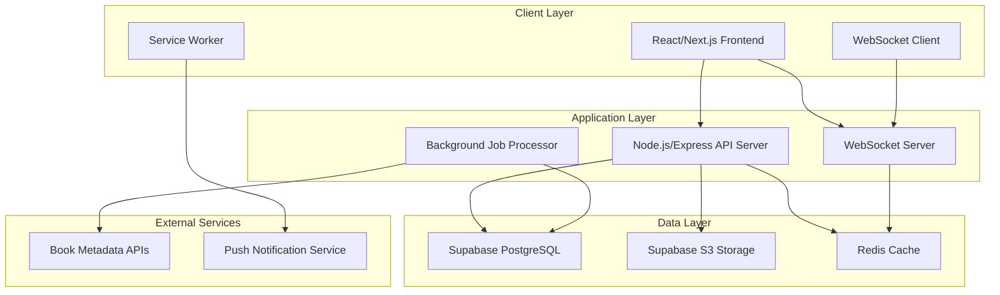

# OursBook Platform - Technical Design Document

## Overview

OursBook is a Netflix-style digital book streaming platform that provides users with an intuitive, carousel-based interface for discovering, reading, and managing digital book collections. The platform combines modern web technologies with real-time communication features, comprehensive user management, and administrative tools for content curation.

### Core Value Proposition

- **Netflix-Style Discovery**: Horizontal carousels with expandable preview cards for intuitive book browsing
- **Real-Time Social Features**: Live chat, notifications, and friend activity updates
- **Multi-Device Continuity**: Seamless reading experience across all user devices
- **Comprehensive Management**: Advanced admin tools for content and user management
- **Tiered Access**: Flexible subscription plans with progressive feature unlocking

### Key Technical Challenges

1. **Expanding Card Animation**: Featured cards that expand outside carousel margins while maintaining smooth UX
2. **Real-Time Persistence**: Notifications and chat that work even when browser is closed
3. **Cross-Device Synchronization**: Reading progress and session state across multiple devices
4. **Metadata Enrichment**: Automated book information completion from external sources
5. **Performance at Scale**: Efficient carousel rendering and book file delivery

## Architecture

### System Architecture Overview

The OursBook platform follows a modern three-tier architecture with real-time capabilities:



### Technology Stack

**Frontend Stack:**
- **Framework**: Next.js 14 with App Router for SSR and optimal performance
- **UI Library**: React 18 with custom Netflix-style components
- **Styling**: Tailwind CSS with custom animations for carousel effects
- **State Management**: Zustand for client state, React Query for server state
- **Real-time**: Socket.io client for WebSocket connections
- **PWA**: Service Workers for offline notifications and caching

**Backend Stack:**
- **Runtime**: Node.js 20 with Express.js framework
- **Database**: Supabase PostgreSQL with Row Level Security
- **File Storage**: Supabase S3 for book files and media assets
- **Caching**: Redis for session management and real-time data
- **Real-time**: Socket.io server for WebSocket connections
- **Background Jobs**: Bull Queue with Redis for async processing
- **Authentication**: Supabase Auth with JWT tokens

**Infrastructure:**
- **Hosting**: Vercel for frontend, Railway/Render for backend
- **CDN**: Vercel Edge Network for global content delivery
- **Monitoring**: Sentry for error tracking, Vercel Analytics for performance
- **CI/CD**: GitHub Actions with automated testing and deployment

## Components and Interfaces

### Frontend Component Architecture

#### Core UI Components

**BookCarousel Component**
```typescript
interface BookCarouselProps {
  title: string;
  books: Book[];
  category?: string;
  showArrows?: boolean;
  expandOnHover?: boolean;
}

interface CarouselState {
  currentIndex: number;
  isScrolling: boolean;
  expandedCard: string | null;
  visibleRange: [number, number];
}
```

**FeaturedCard Component**
```typescript
interface FeaturedCardProps {
  book: Book;
  isExpanded: boolean;
  onExpand: (bookId: string) => void;
  onCollapse: () => void;
  position: 'left' | 'center' | 'right';
}

interface CardAnimationState {
  scale: number;
  zIndex: number;
  translateX: number;
  translateY: number;
  opacity: number;
}
```

**BookReader Component**
```typescript
interface BookReaderProps {
  bookId: string;
  initialPage?: number;
  onProgressUpdate: (progress: ReadingProgress) => void;
}

interface ReadingProgress {
  bookId: string;
  currentPage: number;
  totalPages: number;
  timeSpent: number;
  lastReadAt: Date;
}
```

#### Real-Time Components

**ChatSystem Component**
```typescript
interface ChatSystemProps {
  roomId?: string;
  isPrivate: boolean;
  participants: User[];
}

interface ChatMessage {
  id: string;
  senderId: string;
  content: string;
  timestamp: Date;
  type: 'text' | 'system' | 'book_share';
}
```

**NotificationCenter Component**
```typescript
interface NotificationCenterProps {
  userId: string;
  maxVisible: number;
}

interface Notification {
  id: string;
  type: 'message' | 'friend_activity' | 'system' | 'achievement';
  title: string;
  content: string;
  isRead: boolean;
  createdAt: Date;
  actionUrl?: string;
}
```

### Backend API Architecture

#### Core API Endpoints

**Book Management API**
```typescript
// GET /api/books
interface GetBooksQuery {
  category?: string;
  search?: string;
  limit?: number;
  offset?: number;
  sortBy?: 'title' | 'author' | 'rating' | 'recent';
}

// POST /api/books/:id/progress
interface UpdateProgressRequest {
  currentPage: number;
  timeSpent: number;
  bookmarks?: Bookmark[];
  notes?: Note[];
}
```

**User Management API**
```typescript
// GET /api/users/profile
interface UserProfile {
  id: string;
  username: string;
  email: string;
  profilePicture?: string;
  coverImage?: string;
  subscriptionTier: 'basic' | 'premium' | 'ultimate';
  badges: Badge[];
  ranking: UserRanking;
  readingStats: ReadingStatistics;
}

// POST /api/users/follow
interface FollowRequest {
  targetUserId: string;
}
```

**Real-Time API**
```typescript
// WebSocket Events
interface SocketEvents {
  'chat:join': { roomId: string };
  'chat:message': ChatMessage;
  'notification:new': Notification;
  'session:sync': SessionData;
  'reading:progress': ReadingProgress;
}
```

#### Admin Panel API

**Content Management API**
```typescript
// POST /api/admin/books/import
interface BookImportRequest {
  source: 'url' | 'file' | 'isbn';
  data: string | File;
  enrichMetadata: boolean;
}

// GET /api/admin/analytics
interface AnalyticsResponse {
  topBooks: BookAnalytics[];
  userActivity: UserActivityStats[];
  systemMetrics: SystemMetrics;
}
```

### Database Integration Layer

**Repository Pattern Implementation**
```typescript
interface BookRepository {
  findById(id: string): Promise<Book | null>;
  findByCategory(category: string, pagination: Pagination): Promise<Book[]>;
  search(query: string, filters: BookFilters): Promise<Book[]>;
  updateMetadata(id: string, metadata: BookMetadata): Promise<void>;
}

interface UserRepository {
  findById(id: string): Promise<User | null>;
  updateReadingProgress(userId: string, progress: ReadingProgress): Promise<void>;
  getFollowers(userId: string): Promise<User[]>;
  updateSubscription(userId: string, tier: SubscriptionTier): Promise<void>;
}
```

## Data Models

### Core Entity Models

#### User Management Schema

```sql
-- Users table with comprehensive profile data
CREATE TABLE users (
    id UUID PRIMARY KEY DEFAULT gen_random_uuid(),
    email VARCHAR(255) UNIQUE NOT NULL,
    username VARCHAR(50) UNIQUE NOT NULL,
    password_hash VARCHAR(255) NOT NULL,
    profile_picture_url TEXT,
    cover_image_url TEXT,
    subscription_tier subscription_tier_enum DEFAULT 'basic',
    created_at TIMESTAMP WITH TIME ZONE DEFAULT NOW(),
    updated_at TIMESTAMP WITH TIME ZONE DEFAULT NOW(),
    last_active_at TIMESTAMP WITH TIME ZONE DEFAULT NOW(),
    is_active BOOLEAN DEFAULT true
);

-- User relationships for social features
CREATE TABLE user_relationships (
    id UUID PRIMARY KEY DEFAULT gen_random_uuid(),
    follower_id UUID REFERENCES users(id) ON DELETE CASCADE,
    following_id UUID REFERENCES users(id) ON DELETE CASCADE,
    created_at TIMESTAMP WITH TIME ZONE DEFAULT NOW(),
    UNIQUE(follower_id, following_id)
);

-- User sessions for multi-device management
CREATE TABLE user_sessions (
    id UUID PRIMARY KEY DEFAULT gen_random_uuid(),
    user_id UUID REFERENCES users(id) ON DELETE CASCADE,
    device_info JSONB NOT NULL,
    ip_address INET,
    user_agent TEXT,
    is_active BOOLEAN DEFAULT true,
    created_at TIMESTAMP WITH TIME ZONE DEFAULT NOW(),
    last_accessed_at TIMESTAMP WITH TIME ZONE DEFAULT NOW()
);
```

#### Book Catalog Schema

```sql
-- Books table with comprehensive metadata
CREATE TABLE books (
    id UUID PRIMARY KEY DEFAULT gen_random_uuid(),
    title VARCHAR(500) NOT NULL,
    author VARCHAR(255) NOT NULL,
    isbn VARCHAR(20) UNIQUE,
    description TEXT,
    genre VARCHAR(100),
    publication_date DATE,
    page_count INTEGER,
    language VARCHAR(10) DEFAULT 'en',
    cover_image_url TEXT,
    file_url TEXT NOT NULL,
    file_size BIGINT,
    file_format VARCHAR(10) DEFAULT 'pdf',
    rating DECIMAL(3,2) DEFAULT 0.0,
    download_count INTEGER DEFAULT 0,
    view_count INTEGER DEFAULT 0,
    is_featured BOOLEAN DEFAULT false,
    metadata_complete BOOLEAN DEFAULT false,
    created_at TIMESTAMP WITH TIME ZONE DEFAULT NOW(),
    updated_at TIMESTAMP WITH TIME ZONE DEFAULT NOW()
);

-- Book categories for carousel organization
CREATE TABLE book_categories (
    id UUID PRIMARY KEY DEFAULT gen_random_uuid(),
    name VARCHAR(100) UNIQUE NOT NULL,
    display_order INTEGER DEFAULT 0,
    is_active BOOLEAN DEFAULT true
);

CREATE TABLE book_category_assignments (
    book_id UUID REFERENCES books(id) ON DELETE CASCADE,
    category_id UUID REFERENCES book_categories(id) ON DELETE CASCADE,
    PRIMARY KEY (book_id, category_id)
);
```

#### Reading Progress Schema

```sql
-- Reading sessions and progress tracking
CREATE TABLE reading_sessions (
    id UUID PRIMARY KEY DEFAULT gen_random_uuid(),
    user_id UUID REFERENCES users(id) ON DELETE CASCADE,
    book_id UUID REFERENCES books(id) ON DELETE CASCADE,
    current_page INTEGER DEFAULT 1,
    total_pages INTEGER,
    time_spent_minutes INTEGER DEFAULT 0,
    last_read_at TIMESTAMP WITH TIME ZONE DEFAULT NOW(),
    is_completed BOOLEAN DEFAULT false,
    completion_date TIMESTAMP WITH TIME ZONE,
    device_info JSONB,
    UNIQUE(user_id, book_id)
);

-- Bookmarks and notes
CREATE TABLE bookmarks (
    id UUID PRIMARY KEY DEFAULT gen_random_uuid(),
    user_id UUID REFERENCES users(id) ON DELETE CASCADE,
    book_id UUID REFERENCES books(id) ON DELETE CASCADE,
    page_number INTEGER NOT NULL,
    note TEXT,
    created_at TIMESTAMP WITH TIME ZONE DEFAULT NOW()
);

-- User book lists (favorites, want to read, etc.)
CREATE TABLE user_book_lists (
    id UUID PRIMARY KEY DEFAULT gen_random_uuid(),
    user_id UUID REFERENCES users(id) ON DELETE CASCADE,
    book_id UUID REFERENCES books(id) ON DELETE CASCADE,
    list_type list_type_enum NOT NULL, -- 'favorites', 'want_to_read', 'completed'
    added_at TIMESTAMP WITH TIME ZONE DEFAULT NOW(),
    UNIQUE(user_id, book_id, list_type)
);
```

#### Social Features Schema

```sql
-- Chat rooms and messages
CREATE TABLE chat_rooms (
    id UUID PRIMARY KEY DEFAULT gen_random_uuid(),
    name VARCHAR(255),
    is_private BOOLEAN DEFAULT false,
    created_by UUID REFERENCES users(id),
    created_at TIMESTAMP WITH TIME ZONE DEFAULT NOW(),
    is_active BOOLEAN DEFAULT true
);

CREATE TABLE chat_participants (
    room_id UUID REFERENCES chat_rooms(id) ON DELETE CASCADE,
    user_id UUID REFERENCES users(id) ON DELETE CASCADE,
    joined_at TIMESTAMP WITH TIME ZONE DEFAULT NOW(),
    is_active BOOLEAN DEFAULT true,
    PRIMARY KEY (room_id, user_id)
);

CREATE TABLE chat_messages (
    id UUID PRIMARY KEY DEFAULT gen_random_uuid(),
    room_id UUID REFERENCES chat_rooms(id) ON DELETE CASCADE,
    sender_id UUID REFERENCES users(id) ON DELETE CASCADE,
    content TEXT NOT NULL,
    message_type message_type_enum DEFAULT 'text',
    created_at TIMESTAMP WITH TIME ZONE DEFAULT NOW(),
    edited_at TIMESTAMP WITH TIME ZONE,
    is_deleted BOOLEAN DEFAULT false
);

-- Notifications system
CREATE TABLE notifications (
    id UUID PRIMARY KEY DEFAULT gen_random_uuid(),
    user_id UUID REFERENCES users(id) ON DELETE CASCADE,
    type notification_type_enum NOT NULL,
    title VARCHAR(255) NOT NULL,
    content TEXT,
    action_url TEXT,
    is_read BOOLEAN DEFAULT false,
    created_at TIMESTAMP WITH TIME ZONE DEFAULT NOW(),
    expires_at TIMESTAMP WITH TIME ZONE
);
```

#### Gamification Schema

```sql
-- Badge system
CREATE TABLE badges (
    id UUID PRIMARY KEY DEFAULT gen_random_uuid(),
    name VARCHAR(100) UNIQUE NOT NULL,
    description TEXT,
    icon_url TEXT,
    criteria JSONB NOT NULL, -- Conditions for earning the badge
    points INTEGER DEFAULT 0,
    is_active BOOLEAN DEFAULT true
);

CREATE TABLE user_badges (
    id UUID PRIMARY KEY DEFAULT gen_random_uuid(),
    user_id UUID REFERENCES users(id) ON DELETE CASCADE,
    badge_id UUID REFERENCES badges(id) ON DELETE CASCADE,
    earned_at TIMESTAMP WITH TIME ZONE DEFAULT NOW(),
    UNIQUE(user_id, badge_id)
);

-- User ranking system
CREATE TABLE user_rankings (
    user_id UUID PRIMARY KEY REFERENCES users(id) ON DELETE CASCADE,
    total_points INTEGER DEFAULT 0,
    books_read INTEGER DEFAULT 0,
    books_downloaded INTEGER DEFAULT 0,
    reading_time_minutes INTEGER DEFAULT 0,
    social_interactions INTEGER DEFAULT 0,
    rank_position INTEGER,
    last_calculated_at TIMESTAMP WITH TIME ZONE DEFAULT NOW()
);
```

#### Administrative Schema

```sql
-- Book suggestions from users
CREATE TABLE book_suggestions (
    id UUID PRIMARY KEY DEFAULT gen_random_uuid(),
    user_id UUID REFERENCES users(id) ON DELETE CASCADE,
    title VARCHAR(500) NOT NULL,
    author VARCHAR(255),
    isbn VARCHAR(20),
    description TEXT,
    source_url TEXT,
    status suggestion_status_enum DEFAULT 'pending',
    admin_notes TEXT,
    created_at TIMESTAMP WITH TIME ZONE DEFAULT NOW(),
    reviewed_at TIMESTAMP WITH TIME ZONE,
    reviewed_by UUID REFERENCES users(id)
);

-- System analytics and metrics
CREATE TABLE analytics_events (
    id UUID PRIMARY KEY DEFAULT gen_random_uuid(),
    event_type VARCHAR(100) NOT NULL,
    user_id UUID REFERENCES users(id),
    book_id UUID REFERENCES books(id),
    event_data JSONB,
    created_at TIMESTAMP WITH TIME ZONE DEFAULT NOW()
);
```

### Enum Types

```sql
CREATE TYPE subscription_tier_enum AS ENUM ('basic', 'premium', 'ultimate');
CREATE TYPE list_type_enum AS ENUM ('favorites', 'want_to_read', 'completed', 'currently_reading');
CREATE TYPE message_type_enum AS ENUM ('text', 'system', 'book_share');
CREATE TYPE notification_type_enum AS ENUM ('message', 'friend_activity', 'system', 'achievement');
CREATE TYPE suggestion_status_enum AS ENUM ('pending', 'approved', 'rejected', 'in_progress');
```

### Data Relationships and Constraints

**Key Relationships:**
- Users have many reading sessions, bookmarks, and social relationships
- Books belong to multiple categories and have many reading sessions
- Chat rooms contain multiple participants and messages
- Notifications are user-specific with expiration capabilities
- Badge system tracks user achievements with point accumulation
- Rankings are calculated based on multiple user activity metrics

**Performance Indexes:**
```sql
-- Critical performance indexes
CREATE INDEX idx_books_genre ON books(genre);
CREATE INDEX idx_books_featured ON books(is_featured) WHERE is_featured = true;
CREATE INDEX idx_reading_sessions_user_book ON reading_sessions(user_id, book_id);
CREATE INDEX idx_chat_messages_room_created ON chat_messages(room_id, created_at DESC);
CREATE INDEX idx_notifications_user_unread ON notifications(user_id, is_read) WHERE is_read = false;
CREATE INDEX idx_user_rankings_position ON user_rankings(rank_position);
```

## Error Handling

### Frontend Error Handling Strategy

**Component-Level Error Boundaries**
```typescript
interface ErrorBoundaryState {
  hasError: boolean;
  error: Error | null;
  errorInfo: ErrorInfo | null;
}

class BookCarouselErrorBoundary extends Component<Props, ErrorBoundaryState> {
  // Graceful degradation for carousel failures
  // Fallback to simple grid layout
  // Log errors to monitoring service
}
```

**API Error Handling**
- **Network Failures**: Automatic retry with exponential backoff
- **Authentication Errors**: Redirect to login with context preservation
- **Rate Limiting**: Queue requests with user feedback
- **Validation Errors**: Field-specific error messages with correction hints

**Real-Time Connection Handling**
- **WebSocket Disconnection**: Automatic reconnection with exponential backoff
- **Message Delivery Failures**: Local queuing with retry mechanism
- **Notification Failures**: Fallback to in-app notifications

### Backend Error Handling Strategy

**API Error Response Format**
```typescript
interface APIErrorResponse {
  error: {
    code: string;
    message: string;
    details?: Record<string, any>;
    timestamp: string;
    requestId: string;
  };
}
```

**Database Error Handling**
- **Connection Failures**: Connection pooling with health checks
- **Query Timeouts**: Configurable timeout limits with fallback queries
- **Constraint Violations**: User-friendly error messages
- **Transaction Failures**: Automatic rollback with error logging

**File Storage Error Handling**
- **Upload Failures**: Chunked upload with resume capability
- **Storage Quota**: Proactive monitoring with user notifications
- **File Corruption**: Checksum validation with re-upload prompts

**External Service Integration**
- **Metadata API Failures**: Graceful degradation to manual entry
- **Third-Party Timeouts**: Circuit breaker pattern implementation
- **Rate Limiting**: Request queuing with priority handling

### Monitoring and Alerting

**Error Tracking**
- **Sentry Integration**: Comprehensive error capture and analysis
- **Custom Error Categories**: Book-specific, user-specific, and system errors
- **Performance Monitoring**: Real-time performance metrics and alerts

**Health Checks**
- **Database Connectivity**: Automated health monitoring
- **External Service Status**: Regular ping checks with status dashboard
- **Storage Availability**: Capacity and accessibility monitoring

## Testing Strategy

### Testing Approach Overview

The OursBook platform requires a comprehensive testing strategy that addresses the complexity of real-time features, multi-device synchronization, and rich user interfaces. Since this platform primarily involves UI interactions, database operations, real-time communication, and external service integrations, we will focus on **example-based unit tests**, **integration tests**, and **end-to-end tests** rather than property-based testing.

**Why Property-Based Testing is Not Applicable:**
- The system is primarily focused on UI rendering, real-time communication, and database operations
- Most functionality involves coordinating between services rather than pure algorithmic logic
- The value lies in testing specific user workflows and integration points
- External dependencies (Supabase, file storage, metadata APIs) make property-based testing impractical

### Unit Testing Strategy

**Frontend Component Testing**
```typescript
// Example: BookCarousel component tests
describe('BookCarousel', () => {
  it('should render books in horizontal layout', () => {
    const books = createMockBooks(5);
    render(<BookCarousel books={books} title="Featured" />);
    expect(screen.getByText('Featured')).toBeInTheDocument();
    expect(screen.getAllByTestId('book-card')).toHaveLength(5);
  });

  it('should expand card on hover and collapse on mouse leave', async () => {
    const books = createMockBooks(3);
    render(<BookCarousel books={books} expandOnHover={true} />);
    
    const firstCard = screen.getAllByTestId('book-card')[0];
    fireEvent.mouseEnter(firstCard);
    
    await waitFor(() => {
      expect(firstCard).toHaveClass('expanded');
    });
    
    fireEvent.mouseLeave(firstCard);
    await waitFor(() => {
      expect(firstCard).not.toHaveClass('expanded');
    });
  });

  it('should handle navigation arrows correctly', () => {
    const books = createMockBooks(10);
    render(<BookCarousel books={books} showArrows={true} />);
    
    const nextButton = screen.getByTestId('carousel-next');
    fireEvent.click(nextButton);
    
    // Verify carousel scrolled to next set of books
    expect(screen.getByTestId('carousel-container')).toHaveStyle({
      transform: 'translateX(-300px)'
    });
  });
});
```

**Backend API Testing**
```typescript
// Example: Book management API tests
describe('Book API', () => {
  it('should return books filtered by category', async () => {
    const mockBooks = await createMockBooksInDB(['fiction', 'mystery']);
    
    const response = await request(app)
      .get('/api/books')
      .query({ category: 'fiction' });
    
    expect(response.status).toBe(200);
    expect(response.body.books).toHaveLength(1);
    expect(response.body.books[0].genre).toBe('fiction');
  });

  it('should update reading progress correctly', async () => {
    const user = await createMockUser();
    const book = await createMockBook();
    
    const progressData = {
      currentPage: 45,
      timeSpent: 30,
      bookmarks: [{ page: 42, note: 'Important quote' }]
    };
    
    const response = await request(app)
      .post(`/api/books/${book.id}/progress`)
      .set('Authorization', `Bearer ${user.token}`)
      .send(progressData);
    
    expect(response.status).toBe(200);
    
    // Verify progress was saved to database
    const session = await ReadingSession.findOne({
      where: { userId: user.id, bookId: book.id }
    });
    expect(session.currentPage).toBe(45);
    expect(session.timeSpentMinutes).toBe(30);
  });
});
```

### Integration Testing Strategy

**Database Integration Tests**
- Test complete user workflows (registration → book selection → reading progress)
- Verify data consistency across related tables
- Test transaction rollbacks and error scenarios
- Validate foreign key constraints and cascading deletes

**Real-Time Feature Integration**
```typescript
// Example: Chat system integration test
describe('Chat System Integration', () => {
  it('should deliver messages between users in real-time', async () => {
    const [user1, user2] = await createMockUsers(2);
    const room = await createChatRoom([user1.id, user2.id]);
    
    const client1 = io(`http://localhost:${PORT}`, {
      auth: { token: user1.token }
    });
    const client2 = io(`http://localhost:${PORT}`, {
      auth: { token: user2.token }
    });
    
    await Promise.all([
      waitForConnection(client1),
      waitForConnection(client2)
    ]);
    
    // Join room
    client1.emit('chat:join', { roomId: room.id });
    client2.emit('chat:join', { roomId: room.id });
    
    // Send message from user1
    const message = { content: 'Hello from user1!', roomId: room.id };
    client1.emit('chat:message', message);
    
    // Verify user2 receives the message
    const receivedMessage = await waitForEvent(client2, 'chat:message');
    expect(receivedMessage.content).toBe('Hello from user1!');
    expect(receivedMessage.senderId).toBe(user1.id);
  });
});
```

**External Service Integration**
- Mock external APIs (metadata enrichment services)
- Test file upload/download workflows with Supabase S3
- Verify authentication flows with Supabase Auth
- Test notification delivery through push services

### End-to-End Testing Strategy

**Critical User Journeys**
```typescript
// Example: Complete reading workflow E2E test
describe('Reading Workflow E2E', () => {
  it('should allow user to discover, start reading, and sync across devices', async () => {
    // Setup: Create user and books
    const user = await createTestUser();
    const books = await createTestBooks(5);
    
    // Step 1: User logs in and browses books
    await page.goto('/login');
    await page.fill('[data-testid="email"]', user.email);
    await page.fill('[data-testid="password"]', user.password);
    await page.click('[data-testid="login-button"]');
    
    // Step 2: User discovers book through carousel
    await page.waitForSelector('[data-testid="book-carousel"]');
    const firstBook = page.locator('[data-testid="book-card"]').first();
    await firstBook.hover();
    
    // Verify featured card expands
    await expect(firstBook).toHaveClass(/expanded/);
    
    // Step 3: User starts reading
    await firstBook.locator('[data-testid="read-now-button"]').click();
    await page.waitForSelector('[data-testid="book-reader"]');
    
    // Step 4: User reads and progress is tracked
    await page.click('[data-testid="next-page"]');
    await page.click('[data-testid="next-page"]');
    
    // Step 5: Verify progress is saved
    const progress = await page.locator('[data-testid="progress-indicator"]');
    await expect(progress).toContainText('Page 3');
    
    // Step 6: Simulate device switch (new browser context)
    const newContext = await browser.newContext();
    const newPage = await newContext.newPage();
    
    // Login on new device
    await newPage.goto('/login');
    await newPage.fill('[data-testid="email"]', user.email);
    await newPage.fill('[data-testid="password"]', user.password);
    await newPage.click('[data-testid="login-button"]');
    
    // Step 7: Verify reading progress synced
    await newPage.goto(`/books/${books[0].id}/read`);
    const syncedProgress = await newPage.locator('[data-testid="progress-indicator"]');
    await expect(syncedProgress).toContainText('Page 3');
  });
});
```

**Admin Panel E2E Tests**
- Book import and metadata enrichment workflows
- User management and analytics dashboard functionality
- Content moderation and suggestion management

### Performance Testing Strategy

**Load Testing**
- Concurrent user sessions with reading progress updates
- Real-time chat performance under high message volume
- Carousel rendering performance with large book catalogs
- File upload/download performance testing

**Stress Testing**
- Database connection limits under peak load
- WebSocket connection scaling
- Memory usage during extended reading sessions
- Storage capacity and retrieval speed

### Testing Infrastructure

**Test Environment Setup**
- **Database**: Isolated test database with seed data
- **File Storage**: Mock S3 service for file operations
- **Real-Time**: Test WebSocket server with message queuing
- **External APIs**: Mock services for metadata and notifications

**Continuous Integration**
- **Unit Tests**: Run on every commit with coverage reporting
- **Integration Tests**: Run on pull requests with database setup
- **E2E Tests**: Run on staging deployment with full environment
- **Performance Tests**: Scheduled runs with performance regression detection

**Test Data Management**
- **Factories**: Consistent test data creation with realistic relationships
- **Fixtures**: Pre-defined datasets for complex scenarios
- **Cleanup**: Automated test data cleanup between test runs
- **Seeding**: Reproducible test environments with known data states

This comprehensive testing strategy ensures the OursBook platform maintains high quality across all user interactions, real-time features, and administrative functions while providing confidence in the system's reliability and performance.